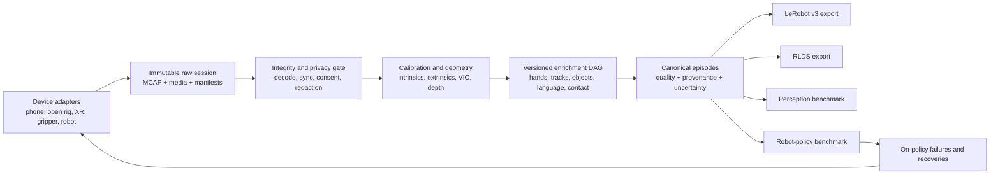

# MoboCapture research and reference architecture

**Research snapshot:** 13 August 2026  
**Scope:** open, modular capture of human demonstrations for robot learning, from ordinary phones through dedicated hardware  
**Status:** landscape research and proposed design; not yet an implemented or validated system

### Research method and confidence

This review prioritizes primary sources: papers, project repositories, official device documentation, dataset cards, specifications, and legislation. It links more than 50 distinct sources. Peer-reviewed results and released artifacts are treated as stronger evidence than preprints; preprints newer than the research snapshot are impossible by definition, while the newest cited work has not yet received long-term scrutiny. Company scale/performance figures are labeled as claims. Hardware, licenses, privacy controls, and robot-policy gains have not been independently reproduced as part of this desk research. That replication is deliberately included in the roadmap rather than assumed.

## Executive conclusion

The project is worthwhile, but the strongest version of it is different from “build an open head camera that tracks hands.” In 2026 that narrow problem is already crowded:

- [STERA / MobileEgo Anywhere](https://arxiv.org/abs/2605.05945) records RGB-D, inertial data, calibration, and ARKit camera pose from LiDAR iPhones in an MCAP-based pipeline; its [SDK is Apache-2.0](https://github.com/fpv-labs/stera-sdk).
- [EgoVerse](https://egoverse.ai/) unifies data from Project Aria glasses, phone head mounts, and custom stereo rigs around camera pose and 3D hands; its [repository](https://github.com/GaTech-RL2/EgoVerse) also illustrates how difficult coordinate conventions and schema migrations are at scale.
- The new [Ego-OSCAR preprint](https://arxiv.org/abs/2608.08285) describes a sub-$200 open head rig with synchronized global-shutter stereo, IMU, an SBC, and an ESP32-S3, plus a 550-hour-per-camera corpus. Its paper is promising, but its public artifacts, exact licenses, odometry robustness, and downstream robot utility should be independently verified before MoboCapture depends on it.
- [OpenEgo](https://github.com/ahadjawaid/openego) is aggregating public egocentric data into shared hand and intention representations.

MoboCapture should therefore be an **open interoperability, quality, privacy, and robot-validation layer**, with a reference device only where existing open hardware proves insufficient. Its durable advantages should be:

1. A capability-driven protocol that does not assume one phone, headset, or sensor layout.
2. Immutable raw data plus reproducible, versioned derived annotations.
3. Honest separation of measured, device-estimated, offline-estimated, human-annotated, and synthetic signals.
4. Calibration, clock synchronization, uncertainty, and coordinate-frame conventions treated as first-class data.
5. A permissive and genuinely open software/hardware/data stack, with privacy rights separate from copyright licensing.
6. Evidence that each modality and device tier improves real robot learning under a fixed training budget.

The “best dataset” is not the one with the most hours or labels. It is the one whose observations and actions are sufficiently calibrated, diverse, legally usable, quality-scored, and aligned with the target robot—and whose value has been measured on held-out robot tasks.

## 1. Direct answer: what current systems actually capture

They do much more than hand tracking, and some successful systems do not track bare hands at all.

| Signal | Why it matters | How current systems obtain it | Main failure mode |
|---|---|---|---|
| Egocentric RGB | Semantics, task context, object appearance | Head camera, phone, glasses, wrist camera | Motion blur, occlusion, privacy, wrong robot viewpoint |
| Camera/head 6-DoF pose | Metric motion and scene reconstruction | Visual-inertial odometry, SLAM, ARKit/ARCore | Drift, tracking loss, dynamic/textureless scenes |
| Depth/geometry | 3D position, scale, free space, object surfaces | Stereo, LiDAR/ToF, structure from motion, monocular models | Missing edges, dynamic hands, range limits, scale error |
| Hands/wrists/body | Human action and intent | Device hand tracking, mocap gloves, EM tracking, offline vision | Occlusion, anatomical rather than robot-feasible motion |
| Tool/gripper state | Direct robot-like action proxy | Instrumented gripper, wrist SLAM, encoder | Only covers the instrumented embodiment |
| Object motion/state | What changed in the world | Point tracks, masks, keypoints, 6D pose, state labels | Category detection alone does not describe manipulation |
| Contact/force/tactile | Whether and how interaction occurred | Tactile glove, robot force/torque, pressure sensor | Cannot be recovered reliably from ordinary video |
| Gaze/head motion | Attention and active perception | Eye tracking or head-pose proxy | Gaze is not always intent; proprietary hardware |
| Language and outcomes | Goal, steps, success, failure, recovery | Demonstrator label, annotator, speech/VLM enrichment | Hallucinated descriptions and inconsistent taxonomy |
| Native robot state/action | Executable supervision | Teleoperation or robot logs | Expensive, slow, embodiment-specific |

Three patterns recur:

- **Instrument the action.** [UMI](https://umi-gripper.github.io/) uses a handheld parallel-jaw gripper, wrist GoPro, SLAM, and gripper width to recover robot-like end-effector trajectories. It does not need bare-hand tracking or generic object detection. Its [software is MIT-licensed](https://github.com/real-stanford/universal_manipulation_interface).
- **Estimate human action in 3D.** [EgoMimic](https://ego-mimic.github.io/), [EgoDex](https://github.com/apple/ml-egodex), MobileEgo Anywhere, and EgoVerse combine egocentric video with camera pose and 3D hands. These trajectories become action proxies or are aligned with a smaller amount of robot data.
- **Represent world change.** [EgoZero](https://egozero-robot.github.io/), [Motion Tracks](https://portal-cornell.github.io/motion_track_policy/), and [Track2Act](https://homangab.github.io/track2act/) use object points, image tracks, or object motion. This can cross embodiments better than a human joint angle or an object category label.

Therefore:

- Hand tracking is useful, especially wrists, fingertips, grasp type, and bimanual coordination, but it is not sufficient.
- Object **detection** is optional derived metadata. Object **motion, state change, contact, and affordance** are more directly relevant to manipulation.
- LiDAR improves metric geometry but does not supply hand actions, contact forces, task success, or robot-feasible controls.
- For robot training, the most valuable minimum is usually calibrated RGB, exact timestamps, intrinsics/extrinsics, camera trajectory, wrist/hand or tool trajectory, task/outcome labels, and a small aligned set of native robot demonstrations.

## 2. The current landscape

### 2.1 Human-demonstration capture systems

| Project | Capture approach | Robot-relevant representation | Key lesson and limitation |
|---|---|---|---|
| [UMI](https://umi-gripper.github.io/) (RSS 2024) | Handheld parallel-jaw gripper plus wrist GoPro/IMU | Relative 6-DoF gripper motion and gripper width | Very actionable and robot-agnostic for parallel-jaw tasks; does not cover bare-hand/dexterous interaction |
| [DexCap](https://dex-cap.github.io/) (RSS 2024) | Chest RGB-D, moved SLAM cameras, electromagnetic gloves | Occlusion-resistant wrist/finger motion and point cloud, retargeted by fingertip IK | Rich dexterity but a costlier, heavier backpack/glove system; [code](https://github.com/j96w/DexCap) is available |
| [EgoMimic](https://ego-mimic.github.io/) (2024) | Project Aria RGB, device SLAM, 3D hands | Human hand and robot trajectories co-trained; human hands can be masked | Demonstrates value from a modest human/robot mixture, but proprietary research hardware and estimated hands remain constraints |
| [EgoDex](https://github.com/apple/ml-egodex) (ICLR 2026) | Apple Vision Pro/ARKit | Camera, upper-body and hand/finger 3D motion, confidence, language | 829 hours and rich tracking; dataset is CC BY-NC-ND, so public does not mean permissive for commercial/open derivative use |
| [EgoMI](https://egocentric-manipulation-interface.github.io/) (2025) | Quest 3S, head and hand tracking, controllers/grippers, head and wrist cameras | Head, hand, gripper action and multiple viewpoints | Shows that active head motion and remembered views matter for mobile manipulation; still proprietary XR hardware |
| [EMMA](https://ego-moma.github.io/) (RA-L 2026) | Human full-body egocentric demonstrations plus robot data | Retargeted base/body motion for mobile manipulation | Extends beyond tabletop arms; retargeting and feasibility need explicit provenance |
| [AINA](https://arxiv.org/abs/2511.16661) | Project Aria Gen 2 with RGB, stereo depth, head/hand tracking | 3D hand and object keypoints | A strong research reference, but relies on proprietary glasses and estimated representations |
| [STERA](https://github.com/fpv-labs/stera-sdk) / [MobileEgo Anywhere](https://openreview.net/forum?id=polyL3vArP) (2026) | Head-mounted LiDAR iPhone, ARKit RGB-D/IMU/pose in MCAP | Depth-localized MANO hands and hierarchical semantic labels | Closest phone baseline; reuse or contribute rather than duplicating it; assess iOS-only assumptions and model/license chain |
| [EgoVerse](https://arxiv.org/abs/2604.07607) (2026) | Aria, head-mounted phones, and custom stereo rigs | Unified camera pose and 21-keypoint hands | Strong evidence for multi-device interoperability and in-domain human anchors; its changing schema is a warning to version conventions from day one |
| [Ego-OSCAR](https://arxiv.org/abs/2608.08285) (Aug. 2026 preprint) | Low-cost synchronized global-shutter stereo plus IMU | Calibrated video, hand estimates, descriptions; proposed stereo-inertial geometry | Most relevant open-hardware neighbor. Reported VIO stability on only 12/20 short held-out sequences and no released trajectory/robot-policy validation in the paper mean replication must precede adoption |

### 2.2 Perception and interaction datasets

- [HOT3D](https://facebookresearch.github.io/hot3d/) provides accurate mocap ground truth for hands and 33 rigid objects, multiview egocentric frames, meshes, gaze, and SLAM geometry. It is excellent for evaluating hand/object perception but is too small and controlled to be the entire policy-training corpus.
- [Ego4D](https://ego4d-data.org/docs/start-here/) provides enormous behavioral diversity, but access uses a custom agreement and credentials. Its [privacy statement](https://ego4d-data.org/pdfs/Ego4D-Privacy-and-ethics-consortium-statement.pdf) is a useful governance reference.
- [HoloAssist](https://github.com/Ember-HoloAssist/holoassist-release) contributes collaborative, annotated egocentric tasks under CDLA-Permissive-2.0.
- [OpenEgo](https://github.com/ahadjawaid/openego) consolidates public egocentric sources, but underlying licenses remain heterogeneous. A unified loader cannot grant rights that the source dataset does not provide.
- [OSMO](https://arxiv.org/abs/2512.08920) and [EgoTouch / TouchAnything](https://jianyi2004.github.io/TouchAnything-Website/) show why contact and tactile information are separate modalities. Vision may predict tactile events, but a prediction must not be labeled as measured force.

Project Aria is a particularly useful reference architecture even though the glasses themselves are proprietary research hardware. Its [Machine Perception Services](https://facebookresearch.github.io/projectaria_tools/docs/ARK/mps) expose open/closed-loop 6-DoF trajectories, semi-dense geometry, calibration, eye gaze, and 21-landmark hand estimates. Its [VRS data format](https://facebookresearch.github.io/projectaria_tools/docs/data_formats/aria_vrs) places heterogeneous sensor samples and configuration in a shared timestamped container. MoboCapture should learn from those semantics while remaining independent of Meta hardware and hosted processing.

### 2.3 Native robot datasets still matter

Human video supplies diversity cheaply, but it does not magically become robot action ground truth.

- [DROID](https://droid-dataset.github.io/) contains approximately 76,000 demonstrations/350 hours across 564 scenes, collected with a standardized Franka setup, calibrated external and wrist cameras, robot state/action, and language.
- [Open X-Embodiment](https://robotics-transformer-x.github.io/) aggregates more than one million real robot trajectories across many embodiments and tasks; its [repository](https://github.com/google-deepmind/open_x_embodiment) uses the RLDS ecosystem.
- [RH20T](https://rh20t.github.io/) includes RGB, depth, infrared, joints, torque, end-effector pose, audio, force/torque, and some tactile data for contact-rich tasks.
- [AgiBot World](https://huggingface.co/agibot-world) now reports over one million trajectories and about 2,976 hours across 217 tasks. This scale is useful, but the embodiment and collection policy are different from passive human video.

The practical data mixture is a pyramid:

1. Web and ordinary egocentric human video for semantics and diversity.
2. Calibrated human demonstrations with 3D action proxies.
3. Simulation/synthetic retargeting for controlled coverage.
4. A smaller amount of high-value native robot or teleoperation data.
5. On-policy robot successes, failures, and recoveries for the final distribution.

This is consistent with NVIDIA's published [GR00T data pyramid](https://developer.nvidia.com/blog/accelerate-generalist-humanoid-robot-development-with-nvidia-isaac-gr00t-n1/) and its [EgoScale](https://research.nvidia.com/labs/gear/egoscale/) work. It is also broadly consistent with company disclosures from [Figure's Project Go-Big](https://www.figure.ai/news/project-go-big) and [Generalist's GEN-0](https://generalistai.com/blog/gen-0). Those company numbers and performance claims are marketing/research disclosures, not independently audited benchmarks, so they are directional evidence only.

### 2.4 Emerging video-to-robot conversion

[EgoEngine](https://arxiv.org/abs/2606.12604) proposes transforming egocentric human video into robot-view video and feasible trajectories. [Ego2Robot](https://arxiv.org/abs/2608.02580) proposes visual robot synthesis, action retargeting, and quality curation at large scale across robot morphologies. These are promising, very recent preprints. MoboCapture should support such transforms as **derived datasets**, while retaining the human raw data and labeling generated robot video/actions as synthetic rather than sensor truth.

## 3. What “best dataset” should mean

No scalar “dataset quality” score is credible across all robot uses. MoboCapture should publish a scorecard with at least these independent axes:

| Axis | Meaning | Example metric |
|---|---|---|
| Sensor fidelity | Is the raw observation decodable, synchronized, and calibrated? | Drop rate, time skew, reprojection error, blur/exposure score |
| Geometric fidelity | Are metric pose/depth estimates trustworthy? | ATE/RPE, depth RMSE/completeness, hand keypoint error |
| Action fidelity | How close is the representation to executable robot control? | Retarget feasibility, IK residual, gripper/contact agreement |
| Semantic fidelity | Are goal, steps, objects, and outcomes correct? | Human audit agreement and held-out label accuracy |
| Diversity | Does the set cover scenes, objects, people, strategies, and failures? | Coverage counts, long-tail entropy, nearest-neighbor duplication |
| Robot alignment | Does it improve a target robot beyond controls? | Held-out success/progress, safety events, interventions |
| Reproducibility | Can every derived artifact be recreated? | Pinned code/model/container/input hashes and deterministic tests |
| Governance | Can the data legally and ethically be used and withdrawn? | Consent coverage, redaction recall, license compatibility, deletion SLA |

Hours remain a useful capacity measure, not proof of value. A thousand hours with drifting poses, repeated kitchens, unknown consent, and generated success labels can be less useful than fifty varied, calibrated hours aligned with a target robot.

### Recommended evidence hierarchy

Every value must carry one of these provenance classes:

1. `measured`: directly emitted by a physical sensor or robot controller.
2. `device_estimated`: emitted by ARKit, ARCore, a headset, or device firmware.
3. `offline_estimated`: produced later by a pinned perception/SLAM model.
4. `human_annotated`: entered or verified by a person.
5. `synthetic`: generated, retargeted, simulated, or rendered.

Never merge them into one unlabeled “ground truth” field. Confidence, covariance where meaningful, model version, input hash, and coordinate frame travel with the value.

## 4. Device capability tiers

Device names should not determine dataset validity. Each session declares capabilities, and the downstream query selects the required evidence.

| Tier | Required capture | Typical outputs | Suitable use | Important caveat |
|---|---|---|---|---|
| C — basic phone | RGB, stable timestamps, intrinsics when exposed, IMU when available | Video; offline monocular depth/hands/pose | Semantic pretraining, task recognition, video models | Metric geometry/action may be unreliable; never invent it |
| B — VIO phone | RGB, IMU, intrinsics, ARKit/ARCore pose | Metric device trajectory plus derived hands/depth | Navigation context and moderate 3D action proxy | Dynamic scenes, low texture, heat and tracking loss still matter |
| A1 — LiDAR iPhone | RGB, ARKit pose, `sceneDepth`, confidence, IMU, intrinsics | RGB-D and camera trajectory; offline hand fitting | Higher-quality local geometry and scale | LiDAR does not provide native iPhone hand skeleton, contact, or robot action |
| A2 — open stereo-inertial rig | Hardware-synchronized global-shutter stereo, high-rate IMU, full calibration | Reproducible stereo depth and VIO inputs | Strong open geometry with controllable sensor stack | Must beat current prototypes on ergonomics and measured VIO reliability |
| Reference XR/glasses | RGB, native hand/head/body/gaze/depth depending on device | Rich device-estimated human state | Benchmarking and import compatibility | Proprietary hardware, firmware, cloud processing, or restrictive terms |
| Action-rich accessory | Instrumented gripper, glove/tactile, wrist cameras | Tool state, contact, dexterous action | High-value manipulation supervision | More friction, cost, and embodiment assumptions |
| Native robot | Robot observation, state, action, force/tactile | Executable controls and outcomes | Alignment anchor and final evaluation | Expensive and platform-specific |

### Official phone-platform constraints

Apple's [world tracking](https://developer.apple.com/documentation/arkit/understanding-world-tracking) fuses image features with inertial motion. Each [ARCamera](https://developer.apple.com/documentation/arkit/arcamera) exposes tracking state, world transform, image resolution, and intrinsics; an [ARFrame has a timestamp](https://developer.apple.com/documentation/arkit/arframe/timestamp). On supported LiDAR devices, [`sceneDepth`](https://developer.apple.com/documentation/arkit/arframe/scenedepth) supplies depth, and [`ARDepthData`](https://developer.apple.com/documentation/arkit/ardepthdata) includes a depth map and confidence map. Capability must be checked at runtime. iPhone ARKit should not be confused with visionOS skeletal hand tracking; MoboCapture must estimate hands offline on iPhone or attach another tracker.

ARCore's [Depth API](https://developers.google.com/ar/develop/depth) derives depth from motion and may merge hardware ToF. It is generally strongest around 0.5–5 m and needs camera motion; textureless surfaces and dynamic hands are difficult. [Raw Depth](https://developers.google.com/ar/develop/java/depth/raw-depth) can provide a sparse, more accurate image plus confidence, but a new depth image may not arrive every frame. [Camera configuration](https://developers.google.com/ar/develop/java/camera-configs) exposes device-dependent frame rate, stream size, and hardware depth/stereo support, and low light can reduce actual frame rate. Android [Camera2 timestamps](https://developer.android.com/reference/android/hardware/camera2/CaptureResult) describe start of exposure, but time bases and cross-subsystem synchronization require inspection per device.

The precision capture core should be native Swift and Kotlin. A cross-platform UI may wrap it later, but should not obscure platform timestamp, calibration, and buffer behavior.

## 5. Proposed system architecture



### 5.1 Raw transport and storage

Use [MCAP](https://mcap.dev/spec) as the primary raw session container because it is appendable, multi-channel, timestamped, and schema-aware. Store encoded image/video samples without silently changing timestamps or dropping metadata. Long recordings remain sessions; task segments become episode views referencing time ranges, so segmentation does not duplicate raw bytes.

A raw session is immutable after finalization. Corrections are new manifests or derived revisions. Each file has a cryptographic hash; manifests form a Merkle-like dependency graph so processing can be traced and invalidated safely.

### 5.2 Training exports

Use [LeRobot Dataset v3](https://huggingface.co/docs/lerobot/lerobot-dataset-v3) as the primary training export: MP4 for video, Parquet for time-series and metadata, sharding, statistics, and streaming. Provide an optional [RLDS](https://github.com/google-research/rlds) exporter for Open X-Embodiment and existing TensorFlow pipelines. These are exports, not the authoritative raw archive.

### 5.3 Plug-in boundaries

Define stable interfaces rather than one monolith:

- `CaptureAdapter`: device discovery, clock description, stream schema, calibration references, samples, health signals.
- `SessionValidator`: decoding, monotonicity, expected-rate and cross-stream checks.
- `Processor`: declared inputs/outputs, container/checkpoint/code/license, resource needs, deterministic seed.
- `PrivacyTransform`: detect, review, redact, encrypt, and record reversible/irreversible policy.
- `EpisodeSegmenter`: human event markers, model proposals, manual corrections, outcome labels.
- `Exporter`: canonical session/episode to LeRobot, RLDS, ROS, or project-specific layouts.
- `Benchmark`: frozen split, metric definitions, training recipe, robot configuration, result manifest.

All processing should work locally. Cloud acceleration may be an optional executor, never a requirement or a hidden source of labels.

## 6. Canonical data contract

### 6.1 Session metadata

At minimum:

```yaml
session_id: uuid
schema_version: semver
created_at_utc: RFC3339
device:
  class: phone | open_rig | xr | accessory | robot
  manufacturer: string
  model: string
  os_firmware_app_versions: {}
capabilities:
  rgb: true
  calibrated_intrinsics: true
  device_pose: false
  metric_depth: false
  hardware_sync: false
recording_profile: {}
clock_domains: []
streams: []
calibration_bundle_id: content_hash
coordinate_convention: mobocapture-v1
consent_policy_version: semver
collection_site_id: pseudonym
demonstrator_id: rotating_pseudonym
raw_manifest_hash: sha256
```

Avoid globally persistent demonstrator identifiers in public data. Maintain the withdrawal mapping in a separate, encrypted governance system.

### 6.2 Stream fields

Every sample or chunk needs:

- stream name, schema, unit, encoding, resolution/rate;
- sensor timestamp, timestamp meaning (for example exposure start), clock domain, host-arrival timestamp if useful;
- sequence number and drop/discontinuity markers;
- source frame and units;
- provenance class;
- confidence/covariance/validity mask where applicable;
- calibration ID and transform-chain references;
- processor identity for derived streams.

Recommended stream names include `camera/head/rgb`, `camera/left/mono`, `camera/right/mono`, `camera/wrist_left/rgb`, `depth/head`, `depth/head/confidence`, `imu/head`, `pose/device`, `hands/left/keypoints_3d`, `objects/tracks_2d`, `tactile/left`, `gaze/ray`, and `events/operator`.

Use unambiguous optical frames (`x` right, `y` down, `z` forward) and body/device frames (`x` forward, `y` left, `z` up), with SI units and right-handed transforms. Specify whether `T_parent_child` maps points from child into parent. A transform must never be interpreted from a field name alone.

### 6.3 Data layers

| Layer | Contents | Can be absent? |
|---|---|---|
| L0 — governance/raw | Consent, policy, device manifest, raw sensor packets | No for a valid session |
| L1 — calibrated sensors | Decoded RGB/depth/IMU, timestamps, intrinsics/extrinsics | Some streams optional; calibration state explicit |
| L2 — geometry | Camera trajectory, depth, point cloud, meshes | Yes |
| L3 — embodiment | Hands/wrists/body/head/gaze/tool state | Yes |
| L4 — interaction | Point/object tracks, masks, 6D object pose, grasp/contact/state change | Yes |
| L5 — semantics | Goal, steps, objects, outcome, failure/recovery, language | Yes, though goal/outcome strongly recommended |
| L6 — robot alignment | Retargeted actions, paired robot data, feasibility/safety labels | Yes; always derived or native provenance |

Missing data is `null` with a reason, not a zero vector. Downstream dataset queries state required layers and minimum quality grades.

### 6.4 Episode and task labels

Each episode should include:

- original goal text and language, plus normalized taxonomy;
- start/end and parent session;
- action primitives and temporal spans where available;
- manipulated object instances and pre/post state;
- left/right/bimanual participation;
- success, partial success, failure, recovery, and who supplied the label;
- variation axes: scene, object instance, initial arrangement, demonstrator, strategy, lighting, clutter;
- privacy/redaction status;
- quality vector, not just one pass/fail bit.

Natural failures are valuable. Do not curate them away. Separate invalid sensor recordings from valid demonstrations of failed behavior.

## 7. Reference open hardware direction

Do not design a PCB first. First reproduce Ego-OSCAR, compare it with a LiDAR iPhone/STERA and a synchronized lab rig, and identify measured gaps. If a reference device remains justified, target:

### Head unit

- Two hardware-triggered, global-shutter monochrome or color cameras, 30/60 fps.
- Approximately 45–65 mm stereo baseline and 110–130° horizontal field of view, finalized by occlusion/range tests rather than aesthetics.
- A low-noise 6-axis IMU at 400–1,000 Hz, with per-unit bias, scale, axis, temperature, and Allan-variance characterization.
- An MCU that is the timing authority: camera triggers, IMU timestamping, watchdog, record button, LED/haptic status, and clock mapping to the SBC.
- A Linux SBC for hardware video encoding, buffering, encryption, storage, health logging, and a local web/app control interface.
- Removable storage and battery kept off the forehead where practical. Aim below 180–200 g on the head; Ego-OSCAR's reported 280 g is a useful ergonomic target to beat.
- Rigid mechanical datum features so calibration is stable and enclosures are replaceable without guesswork.

### Optional modules

- High-resolution center RGB camera for appearance while stereo cameras optimize tracking.
- ToF/LiDAR for near-field completeness, never assumed by the base schema.
- One or two wrist cameras.
- Trigger/PPS/PTP accessory port.
- UMI-like instrumented gripper or open tactile glove.
- External battery/compute belt pack for long sessions.

The [Raspberry Pi Global Shutter Camera](https://www.raspberrypi.com/products/raspberry-pi-global-shutter-camera/) is a useful prototype part (Sony IMX296, 1.58 MP, RAW10, up to 1456×1088 at 60 fps). The [Compute Module 5 datasheet](https://datasheets.raspberrypi.com/cm5/cm5-datasheet.pdf) documents two four-lane MIPI interfaces. [OAK-D](https://docs.luxonis.com/hardware/products/OAK-D) is a fast reference/prototype option with global-shutter stereo, center RGB, depth, and IMU, but MoboCapture should audit every firmware/blob dependency before calling the complete stack open. [VersaVIS](https://arxiv.org/abs/1912.02469) is a useful open synchronization precedent.

“Open hardware” should mean published editable KiCad design, schematics, PCB sources/Gerbers, BOM with alternates, CAD and mount files, firmware/bootloader, host drivers, calibration fixtures, assembly instructions, safety notes, test procedures, and reproducible releases. Commercial image sensors and processors can remain black-box silicon; the project must state that boundary honestly.

Suggested licenses are Apache-2.0 for software and CERN-OHL-S-2.0 or CERN-OHL-P-2.0 for hardware, chosen after contributor and commercialization review.

## 8. Capture workflow

### Before recording

1. Confirm consent and the permitted location/people; warn about mirrors, screens, documents, badges, addresses, and bystanders.
2. Check free space, battery, temperature, lens cleanliness, expected stream rates, calibration ID, and privacy mode.
3. Run a short motion/feature test and show tracking/depth/hand-visibility health—not a single green light hiding multiple failures.
4. Select or speak the goal, object set, and intended outcome.

### During recording

- Preserve 2–3 seconds of context before and after the action.
- Emit explicit event markers for start, important state change, failure, recovery, and end.
- Monitor dropped frames, exposure/blur, thermal throttling, storage write latency, IMU saturation, depth coverage, pose tracking state, hand visibility, and clock skew.
- Give immediate haptic/audio/visual feedback on a fatal recording condition. Avoid distracting the demonstrator with constantly changing scores.
- Permit long natural sessions; segmentation happens through event markers and later review.

### After recording

- Ask for success/partial/failure and a short explanation while memory is fresh.
- Decode every stream and verify monotonic timestamps, sample counts, hashes, duration, calibration references, and privacy policy.
- Upload only after local encryption and resumable integrity checks. Offline collection must remain supported.

### Task coverage

Start with robot-relevant bounded families:

- pick, place, sort, stack, and handoff;
- insert, fit, plug, and align;
- open/close drawers, doors, lids, latches, and zips;
- pour, scoop, spread, and dispense;
- wipe, scrub, sweep, and clean;
- fold, roll, bag, and manipulate deformables;
- screw/unscrew, press, cut, and tool use;
- bimanual stabilization and handover;
- locomotion plus manipulation only after camera/base alignment is validated.

Vary scenes, instances, initial states, clutter, lighting, demonstrators, and strategies deliberately. EgoVerse's central result—that an in-domain human anchor matters and scene diversity can matter more than raw volume—should shape collection quotas.

## 9. Processing and annotations

The processing system is a dependency graph, not a one-time conversion script.

1. **Integrity:** decode, checksum, sample-rate and discontinuity report.
2. **Privacy:** face/plate/screen/document/audio detection, human review where policy requires it, redacted derivative.
3. **Calibration/synchronization:** intrinsics, distortion, stereo/extrinsics, camera-IMU time offset and uncertainty.
4. **Geometry:** device-native pose retained; independently reproducible VIO/SLAM; depth and point cloud; tracking-state spans.
5. **Human state:** 2D hands first, then metric 3D fitting using calibration/depth, with visibility and confidence; body/head/gaze only when useful.
6. **Interaction:** long-range point tracks, object masks/instances, rigid-motion hypotheses, articulation/state transitions, grasp/contact hypotheses.
7. **Semantics:** goal, atomic steps, objects, outcome, failure/recovery, language embeddings. VLM output is a proposal until audited.
8. **Robot alignment:** workspace mapping, feasibility constraints, IK/retargeting residuals, collision/contact assumptions, target embodiment.

Keep original device outputs alongside offline alternatives. A model upgrade creates a new derived version; it never rewrites the old stream or raw session.

## 10. Quality assurance and validation

### 10.1 Sensor-level tests

- Intrinsic reprojection error across focus, temperature, and unit-to-unit variance.
- Stereo extrinsics and depth accuracy/completeness against measured targets.
- Hardware-sync strobe/LED test visible to both cameras and logged by the MCU.
- Camera-IMU temporal/extrinsic calibration and repeated-motion residual.
- IMU Allan deviation, saturation, temperature drift, and vibration sensitivity.
- VIO ATE/RPE against motion capture or surveyed AprilTag trajectories, including rapid head turns, low light, textureless surfaces, mirrors, crowds, and repetitive patterns.
- Mobile OS stress: thermal throttling, calls/notifications, backgrounding, low storage, long recordings, and clock discontinuities.

### 10.2 Perception tests

- Hand keypoint and object pose accuracy on [HOT3D](https://facebookresearch.github.io/hot3d/) and a MoboCapture-specific held-out mocap set.
- Depth accuracy and edge completeness for hands, transparent/reflective objects, thin tools, and deformables.
- Track survival and drift through occlusion.
- Privacy detector recall, not just precision, with human audit on a stratified sample.

### 10.3 The decisive downstream experiment

Capture the same demonstrations simultaneously or nearly identically using:

- a basic phone;
- a VIO phone;
- a LiDAR iPhone;
- the open stereo-inertial rig;
- a high-quality reference tracker/mocap subset;
- an instrumented gripper or native robot where the task permits.

Use frozen train/test splits, equal demonstration time and compute budgets, and run ablations:

- RGB only;
- + camera pose;
- + depth;
- + hands/wrists;
- + point/object motion;
- + language/outcomes;
- + measured contact/tactile;
- human only versus human plus a small in-domain robot anchor.

Report robot task success, progress, generalization to unseen object instances/scenes, collisions/safety interventions, and recovery—not only offline reconstruction loss. Include at least one inexpensive parallel-jaw arm first. Add bimanual/mobile and open dexterous hands only after the base benchmark is stable.

### Proposed recording grades

- **Grade A — action proxy:** calibrated metric geometry, validated trajectory, high-confidence hand/tool state, outcome, and usable robot alignment.
- **Grade B — metric perception:** calibrated RGB plus valid metric pose/depth, but incomplete action state.
- **Grade C — semantic video:** valid RGB/task/outcome with insufficient metric action fidelity.
- **Rejected:** corrupt, unauthorized, unredactable under policy, or so incomplete that declared minimums are false.

A lower-end phone should not be rejected merely for being lower-end. It produces Grade C data honestly. Quality filters operate per task/query.

## 11. Privacy, consent, and licensing

Egocentric capture routinely records faces, voices, screens, homes, documents, location clues, and bystanders. Privacy is architectural, not a post-processing checkbox.

The EU GDPR's [Article 5 principles](https://eur-lex.europa.eu/legal-content/EN/TXT/?uri=CELEX:32016R0679) include purpose limitation and data minimization; identifiable video is personal data, and biometric identification can be special-category processing. The UK ICO's [video-surveillance guidance](https://ico.org.uk/for-organisations/uk-gdpr-guidance-and-resources/cctv-and-video-surveillance/guidance-on-video-surveillance-including-cctv/what-does-this-guidance-address/) is a practical operational reference. In India, consult the official [Digital Personal Data Protection Act, 2023](https://www.indiacode.nic.in/handle/123456789/22037), the [DPDP Rules, 2025](https://www.meity.gov.in/documents/act-and-policies/digital-personal-data-protection-rules-2025-gDOxUjMtQWa), and the phased [commencement notification](https://www.indiacode.nic.in/show-data?abv=CEN&actid=AC_CEN_45_0_00003_2023-22_1763464807080&orderno=1&orgactid=AC_CEN_45_0_00003_2023-22_1763464807080&sectionId=101267&sectionno=1&statehandle=123456789%2F1362). Obtain qualified legal review before public collection or release.

Recommended controls:

- On-device notice and consent tied to a specific policy version and purpose.
- No minors in the initial program; no covert capture.
- No GPS, Wi-Fi scan, contacts, or microphone by default. If speech labels are needed, make audio an explicit, separable stream.
- Visible recording indicator and rapid pause/delete control.
- Face, plate, screen, document, badge, and address redaction before public release.
- Encrypted raw tier with strict access logs; sanitized public tier.
- Scene/bystander exclusion lists and capture-zone signage for organized collections.
- Contributor portal for inspection, correction, withdrawal, and deletion.
- Tombstones and dataset-version revocation so deletion propagates into shards, mirrors, and derivative manifests as far as technically and contractually possible.
- Retention limits for raw identifiers and access mappings.
- A red-team set for mirrors, reflections, screens, photographs, and audio leakage.

### “Open” has three separate meanings

1. **Open-source software:** capture, processing, schema, exporters, tests.
2. **Open hardware:** editable sources, firmware, BOM/CAD, manufacturing and test documents.
3. **Open data:** a dataset license that permits the intended research and commercial/model-training use.

One does not imply the others. A dataset license also cannot waive privacy, publicity, contract, trademark, or property rights. Use per-component SPDX manifests and a machine-readable bill of materials for code, models, datasets, weights, fonts, and firmware. Prefer a permissive dataset agreement or CC BY 4.0 only where contributor consent and third-party rights support it; do not copy restrictive sources into the open corpus merely because a loader can read them.

## 12. Build, fork, or collaborate

### Reuse immediately

- MCAP for raw event storage.
- LeRobot Dataset v3 and RLDS exporters.
- STERA's loader/processing patterns and, subject to a code audit, its Apache-licensed SDK.
- EgoVerse's multi-source schema lessons and evaluation findings.
- UMI's relative action and instrumented-gripper concepts.
- HOT3D for perception validation.
- Established calibration, VIO/SLAM, hand, segmentation, and point-tracking packages with pinned compatible licenses.

### Replicate before choosing

- Ego-OSCAR hardware, timing, calibration, heat, comfort, battery, and VIO robustness.
- Phone-tier claims under identical tasks and real robot-policy evaluation.
- Monocular/estimated depth and hand accuracy in the near-field, where manipulation occurs.

### Build where the gap is real

- The canonical capability/provenance/quality schema.
- Native capture adapters and a conformance test suite.
- Local-first privacy and reproducible enrichment pipeline.
- Cross-tier benchmark and robot validation.
- A lighter or more reliable open reference rig only if replication exposes a material gap.
- Open accessory synchronization and actionable gripper/tactile modules.

Where governance permits, contributing schema adapters and fixes upstream to STERA, EgoVerse, Ego-OSCAR, LeRobot, and related projects is preferable to creating incompatible forks.

## 13. Phased roadmap and gates

### Phase 0 — specification and evidence plan (weeks 0–3)

- Publish the mission, provenance model, coordinate/timestamp convention, capability manifest, privacy threat model, and license policy.
- Select 10 representative tasks and one robot-policy benchmark.
- Obtain research-ethics/privacy/legal review for the pilot.
- Contact STERA, EgoVerse, and Ego-OSCAR maintainers; determine collaboration and artifact status.

**Gate:** external reviewers can implement a conforming sample without private explanations.

### Phase 1 — phone MVP and importers (weeks 3–8)

- Native iOS ARKit and Android ARCore/basic-camera capture into MCAP.
- Import STERA and at least one Aria/EgoVerse-like source.
- Implement session finalization, hashes, health dashboard, calibration registry, event markers, encrypted resumable upload, and raw replay.
- Pilot 10 tasks × 10 people × at least 3 phone capability profiles.

**Gate:** no silent frame loss; timestamp/calibration status is machine-verifiable; every public sample has consent/privacy disposition.

### Phase 2 — enrichment, QA, and exports (months 2–4)

- Reproducible VIO/depth/hand/track/semantic processors.
- LeRobot v3 and RLDS exports.
- Cross-device conformance and quality grading.
- Release a small benchmark, not a giant corpus.

**Gate:** every derived value resolves to inputs, code/model version, license, coordinates, and uncertainty; reprocessing is reproducible.

### Phase 3 — hardware replication and reference design decision (months 4–7)

- Reproduce Ego-OSCAR or document why that is impossible.
- Compare it against phones and a lab reference with strobe, mocap, and depth targets.
- Test comfort, heat, battery, storage, calibration stability, and field failure rate.
- Design a new board only for a measured unmet requirement.

**Gate:** proposed custom hardware produces a statistically meaningful improvement in action/geometry fidelity or operational cost—not merely different hardware.

### Phase 4 — robot anchor and policy proof (months 6–10)

- Capture paired/aligned native robot demonstrations and on-policy data.
- Run fixed-budget modality and device-tier ablations.
- Publish training code, splits, failures, confidence intervals, and negative results.

**Gate:** at least one human-data configuration improves held-out real-robot performance or reduces required robot demonstrations without unacceptable safety regression.

### Phase 5 — scale and ecosystem (months 10–18)

- Only after the policy gate: contributor app, collection campaigns, site kits, dataset versioning, withdrawal automation, and public/private tiers.
- Add tactile, bimanual, mobile, and dexterous embodiments in evidence-driven order.

An initial core team likely needs mobile capture, SLAM/perception, robot learning/data engineering, embedded hardware, and privacy/data operations. Three people can prototype; a credible field dataset and robot benchmark will usually require four to six complementary owners plus collection partners.

## 14. Principal risks

| Risk | Consequence | Mitigation |
|---|---|---|
| Embodiment gap | Human motion is not executable by the target robot | Relative/world-change representations, feasibility metadata, small in-domain robot anchor |
| Hand/object occlusion | Missing action state at the moment of contact | Wide head view, optional wrist views, stereo/depth, temporal fitting, visibility masks |
| VIO/SLAM drift | Wrong metric trajectory and depth alignment | Hardware sync, calibration, uncertainty, tracking spans, loop closure, mocap benchmark |
| Rolling shutter/blur | Broken tracks and geometry on phones | Exposure control, health scoring, global-shutter reference rig |
| Clock drift | Sensor fusion looks plausible but is wrong | Explicit clock domains, trigger tests, sensor and host timestamps, clock-map uncertainty |
| Inferred labels treated as truth | Models train on confident hallucinations | Provenance classes, confidence, human audit, versioned processors |
| Privacy leakage | Harm to people and inability to release data | Data minimization, encryption, redaction, governed tiers, withdrawal pipeline |
| License contamination | “Open” release is legally unusable | SPDX/SBOM, per-source terms, clean-room or exclusion policy |
| Quantity illusion | Large homogeneous corpus with little robot value | Diversity quotas and downstream robot gates before scaling |
| Hardware maintenance burden | Project becomes an abandoned device | Commodity components, alternates, conformance protocol, phones remain first-class |

## 15. Recommended first experiment

Before fundraising around a custom headset or collecting thousands of hours:

1. Choose five tabletop tasks spanning pick/place, articulation, insertion, deformable handling, and tool use.
2. Record 20 demonstrations per task on a basic Android phone, ARCore phone, LiDAR iPhone/STERA, and an Ego-OSCAR-style stereo rig; record a smaller mocap/instrumented reference subset.
3. Collect 20–50 native robot demonstrations per task as the alignment anchor.
4. Process all devices through one provenance-aware schema.
5. Train the same policy recipe with RGB-only and successive modality additions.
6. Test on held-out scenes and object instances and publish success, uncertainty, cost per valid minute, demonstrator setup time, and privacy rejection rate.

This experiment answers the questions that landscape research cannot: whether LiDAR is worth it, whether estimated hands beat point tracks, whether the open rig adds real value, and how much native robot data is needed. Its result should determine the product and hardware roadmap.

## Final recommendation

Proceed, but define MoboCapture as a **measurement and evidence standard**, not just a recorder. Start with phones because they unlock contributors, MCAP because raw multimodal timing matters, LeRobot/RLDS because training interoperability matters, and a small robot benchmark because “robot-ready” must be demonstrated rather than asserted.

Treat STERA, EgoVerse, and Ego-OSCAR as potential upstream partners and baselines. Build custom hardware only after reproducing them and measuring a gap. Preserve raw data forever only where consent and retention policy allow it; preserve provenance always. Keep low-end phones valuable for semantics, high-end phones and stereo rigs valuable for metric geometry, accessories valuable for action/contact, and native robots indispensable for alignment and proof.

That combination—not any one camera, LiDAR, hand detector, or object model—is the credible path to an open dataset that materially improves robot training.
