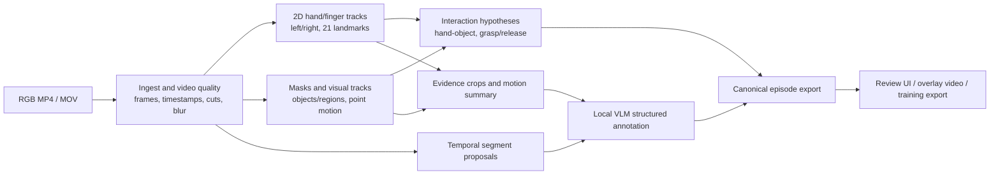

# RGB-first data foundation (MoboCapture v0.1)

**Decision:** Start here. Every MoboCapture device must be able to contribute a useful RGB-first session, even if it has no depth sensor, IMU, LiDAR, or AR tracking.

The first release is an offline pipeline that accepts an RGB video and produces a versioned, evidence-linked set of annotations. It must work locally and must not require a proprietary model API or cloud service.

This is a **quality-first** pipeline. Small/mobile libraries may be used for live preview, but archival annotations use the strongest reproducible model that passes our accuracy, license, and robustness gates. OpenCV remains useful for decoding, geometry, and verification; it is not the default learned detector merely because it is convenient.

## What this milestone delivers

1. **Hands and fingers in 2D:** left/right hand identity, persistent track ID, bounding box, 21 landmarks per visible hand, visibility/confidence, and a hand mask when available.
2. **Structured clip descriptions:** goal, action steps, hand roles, objects, scene, outcome, uncertainty, and the exact time/frame evidence supporting every claim.
3. **Basic visual interaction data:** shot/episode boundaries, video quality, motion and point tracks, object or region masks/tracks, hand-object association, and grasp/contact *hypotheses*.
4. **A visual review artifact:** synchronized video overlays and a JSON/Parquet export. The goal is the useful part of the first and third reference images, before attempting their metric-3D claims.

## The non-negotiable boundary

RGB alone can yield very useful data, but it cannot reliably provide all robot-relevant signals.

| From a single RGB video | Do not claim from a single RGB video |
|---|---|
| 2D hand/finger locations, handedness, masks, temporal motion | Absolute hand position in metres |
| Object/region masks, visual tracks, apparent state changes | Reliable 6-DoF object pose or scene scale |
| Up-to-scale camera motion or monocular depth estimates | Metric camera trajectory, calibrated point cloud, or collision geometry |
| Likely touch/grasp/release and bimanual role | Contact force, pressure, friction, or guaranteed contact |
| Task/step/outcome descriptions with evidence | Ground-truth intent or success without human verification |

The first reference image contains calibrated left/right cameras. Stereo plus calibration can provide metric 3D hands/head position. The second image is a reconstructed 3D scene, which needs a robust structure-from-motion/SLAM pipeline and still requires scale information. Those become later capability layers; they are not fabricated by the RGB-only baseline.

Every output includes one of:

- `measured` - directly in the input video/metadata;
- `offline_estimated` - a vision model or algorithm generated it;
- `human_verified` - a person checked or corrected it.

No output in this release is labeled `ground_truth` by default.

## Pipeline



## Complete RGB-derived data catalog

This section lists the outputs the system can derive. The IDs are an **internal data contract**, not individual library choices in the user interface. The normal UI exposes a short list of capability modules such as Hands, Objects, Motion, Geometry, Interactions, VLM Descriptions, and Privacy. Selecting a module enables its coherent set of outputs and dependencies. MoboCapture chooses, versions, and upgrades the best compatible implementation internally.

The catalog is intentionally broader than the v0.1 milestone so the schema does not need redesign every time a new RGB-derived layer is added.

Reliability labels:

- **D - deterministic:** decoded or calculated directly from pixels/container metadata;
- **E - estimated:** model output with confidence, processor, and model provenance;
- **H - hypothesis:** semantic or physical interpretation that may be wrong;
- **C - conditional:** only meaningful when a prerequisite such as camera intrinsics, sufficient parallax, a CAD model, or human verification exists.

### A. Video source, timing, and image quality

| Selectable ID | What it produces | Type / important limit |
|---|---|---|
| `video.container_metadata` | Codec, resolution, rotation, nominal rate, duration, color space, HDR metadata | D; container values may be missing or false |
| `video.frame_index` | Decoded frame number, PTS/DTS, normalized timestamp, keyframe and byte offset | D; foundational and always enabled |
| `video.timestamp_health` | Non-monotonic time, duplicate PTS, gaps, variable-frame-rate spans | D |
| `video.decode_health` | Corrupt frames, decode errors, concealed blocks, missing frames | D |
| `video.shot_boundaries` | Hard cuts, fades, transitions, recording restarts | E |
| `video.keyframes` | Representative evidence frames per shot/action segment | E; selection policy is versioned |
| `quality.blur` | Defocus and motion-blur score/map | E |
| `quality.exposure` | Under/overexposure and clipped-pixel fractions | D/E |
| `quality.noise` | Sensor-noise estimate and low-light noise span | E |
| `quality.compression` | Blocking, ringing, banding, bitrate instability | E |
| `quality.color` | White-balance/color-cast and saturation anomalies | E |
| `quality.lens_occlusion` | Finger, dirt, condensation, cover, or severe obstruction likelihood | E/H |
| `quality.rolling_shutter` | Rolling-shutter distortion risk and high-motion spans | H; cannot recover the sensor readout model from arbitrary RGB |
| `quality.camera_motion` | Static, slow, rapid, rotational, translational, shake categories | E |
| `quality.usable_regions` | Per-frame/per-region quality mask for downstream processors | E |
| `quality.visibility` | Fraction of hands/objects truncated, occluded, or off-screen | E; depends on detections |
| `video.duplicates` | Exact duplicate frames and repeated frozen spans | D |
| `video.near_duplicates` | Visually near-identical frames/clips | E; embedding-dependent |

### B. Humans, hands, face, and attention

| Selectable ID | What it produces | Type / important limit |
|---|---|---|
| `human.person_detection` | Person boxes, confidence, visible fraction | E |
| `human.person_masks` | Pixel masks for each person | E |
| `human.person_tracks` | Persistent person IDs through the clip | E; IDs are clip-local, not identity recognition |
| `human.body_keypoints_2d` | Body/foot landmarks in pixels | E |
| `human.wholebody_keypoints_2d` | Body, feet, face, and both hands in one skeleton | E |
| `human.body_pose_relative_3d` | Root-relative 3D skeleton | E; not camera/world metric truth |
| `human.body_mesh` | Parametric or mesh body reconstruction | E/C; body-model license and temporal consistency matter |
| `human.motion_tracks` | Smoothed joint trajectories, velocity, acceleration, visibility | E; image-plane units unless metric geometry exists |
| `human.head_box` | Head detection/track | E |
| `human.head_pose` | Yaw, pitch, roll, and head direction | E; not eye gaze |
| `human.face_detection` | Face boxes/masks for analysis and privacy | E |
| `human.face_landmarks` | Eyes, nose, mouth, face contour landmarks | E |
| `human.gaze_target` | In-frame gaze heatmap/target and out-of-frame probability | H; weak for egocentric wearer whose face is unseen |
| `human.attention_proxy` | Head/camera-centered attention proxy | H; must never be called gaze |
| `human.ppe` | Gloves, mask, glasses, helmet, apron, and other visible PPE | E/H; open-vocabulary labels |
| `hand.detection` | Left/right/unknown hand boxes | E |
| `hand.tracks` | Persistent clip-local hand IDs and handedness history | E |
| `hand.keypoints_2d` | 21 landmarks per hand in pixels with per-joint confidence | E |
| `hand.mask` | Pixel-accurate hand masks | E |
| `hand.mesh_relative_3d` | Relative hand mesh/joints and MANO-like parameters | E/C; scale, camera frame, and body-model license explicit |
| `hand.joint_angles` | Estimated finger flexion/abduction angles | E; anatomical model output, not robot joint commands |
| `hand.palm_frame` | Palm center, image-plane orientation, and relative palm normal | E; 3D normal is model-relative without geometry |
| `hand.fingertips` | Thumb/index/middle/ring/little fingertip tracks | E; derived from keypoints |
| `hand.pinch` | Pinch midpoint, pixel aperture, pinch probability | E/H |
| `hand.gesture` | Open, fist, point, pinch, hook, lateral, tripod, unknown | H; probabilities, not forced labels |
| `hand.motion` | Wrist/finger trajectories and confidence-aware derivatives | E |
| `hand.activity_intervals` | Left-only, right-only, bimanual, no-visible-hand spans | E |

Identity recognition, age, ethnicity, emotion, and other sensitive human attributes are deliberately **not** product processors. They are unnecessary for robot learning and create avoidable privacy and bias risks.

### C. Objects, parts, text, and scene structure

| Selectable ID | What it produces | Type / important limit |
|---|---|---|
| `object.open_vocab_detection` | Boxes/phrases for arbitrary prompted object concepts | E; prompt set and thresholds are provenance |
| `object.class_agnostic_masks` | All salient object/region masks without class names | E |
| `object.open_vocab_masks` | Text/exemplar-prompted masks | E |
| `object.instance_tracks` | Persistent mask/box IDs across video | E |
| `object.category_candidates` | Ranked names/synonyms with confidence | E/H; never replaces track ID |
| `object.attributes` | Color, visible shape, size class, pattern, fullness, cleanliness | H; only visible attributes |
| `object.parts` | Handle, lid, blade, button, hinge, opening, wheel, etc. | E/H; prompt/VLM-derived |
| `object.keypoints_2d` | Stable semantic or learned keypoints | E; semantics may be unknown |
| `object.visual_embedding` | Per-object feature vectors for search/re-identification | E |
| `object.instance_reid` | Same-looking-instance links across clips/sessions | H; never treated as certain identity |
| `object.orientation_2d` | Image-plane major axis/orientation | E |
| `object.pose_6d_known` | 6-DoF pose for a known object | C; needs intrinsics plus CAD/reference views and validation |
| `object.pose_6d_unknown` | Relative 6-DoF trajectory for an unknown object | E/C; scale/symmetry ambiguity retained |
| `object.shape_3d_generated` | Hypothesized object mesh/texture from one or more views | H/C; generative completion, not measured unseen geometry |
| `object.material` | Visible material candidates: metal, wood, glass, fabric, plastic | H |
| `object.transparency_reflection` | Transparent/reflective region likelihood | E/H; depth/flow may be unreliable there |
| `object.state` | Open/closed, on/off, full/empty, folded/unfolded, attached/detached | H; task vocabulary and evidence required |
| `object.state_change` | Before/after state transitions with time spans | H |
| `object.articulation` | Candidate joint type, axis, moving part, range | H/C; RGB-only estimate and often needs repeated motion |
| `object.affordances` | Graspable, pourable, openable, cuttable, supportable regions | H; not guaranteed safe/feasible |
| `scene.semantic_segmentation` | Per-pixel class map for known scene classes | E |
| `scene.panoptic_segmentation` | Stuff regions plus countable object instances | E |
| `scene.classification` | Kitchen, workshop, warehouse, sewing station, outdoors, etc. | H |
| `scene.graph` | Object/hand nodes and spatial/interaction edges | H; evidence-linked |
| `scene.spatial_relations` | Left/right, above/below, inside, on, behind, near | E/H; 3D relations require geometry |
| `scene.support_relations` | Supported-by, contained-in, hanging-from, attached-to | H |
| `scene.work_surface` | Table/counter/floor/work area masks and plane candidates | E/C |
| `text.regions` | Visible text boxes and orientation | E |
| `text.ocr` | Transcribed visible text plus language/confidence | E; sensitive information must flow to privacy review |
| `text.barcode_qr` | Barcode/QR type, region, and decoded payload | D/E; payload is sensitive by default |
| `text.labels_controls` | Tool labels, warnings, button legends, display values | H; OCR plus grounding |

### D. Motion, depth, camera, and 3D geometry

| Selectable ID | What it produces | Type / important limit |
|---|---|---|
| `motion.optical_flow` | Dense per-pixel 2D displacement and uncertainty | E |
| `motion.point_tracks_2d` | Long-range point trajectories, visibility, occlusion | E |
| `motion.motion_boundaries` | Discontinuities separating moving regions | E |
| `motion.dynamic_masks` | Moving foreground versus static-background candidates | E; camera motion must be separated |
| `motion.ego_vs_object` | Decomposition of camera-induced and independently moving content | E/C |
| `motion.region_trajectories_2d` | Centroid, contour, orientation, scale tracks | E |
| `motion.periodicity` | Repeated/cyclic movement and estimated cycle count | E/H |
| `geometry.monocular_depth` | Per-pixel relative or model-metric depth plus confidence | E; model scale can be biased and must be validated |
| `geometry.video_consistent_depth` | Temporally consistent depth sequence | E; dynamic hands/objects remain difficult |
| `geometry.surface_normals` | Per-pixel normal estimates | E; derived/dedicated model provenance |
| `geometry.edges_lines` | Structural edges, straight lines, junctions | D/E |
| `geometry.vanishing_points` | Dominant directions and horizon candidates | E |
| `geometry.planes` | Table, wall, floor, cabinet plane candidates | E/C |
| `camera.intrinsics_estimated` | Focal length/principal point/distortion hypotheses | E; captured calibration always wins |
| `camera.pose_relative` | Scale-ambiguous camera trajectory and rotations | E/C; needs parallax/static scene support |
| `camera.motion_events` | Turns, translations, pauses, revisit/loop candidates | E |
| `geometry.pointcloud_relative` | Relative-scale point/point-map reconstruction | E/C; never exported as metric without a scale source |
| `geometry.scene_mesh_relative` | Relative-scale surface mesh | E/C; holes/dynamic artifacts explicit |
| `geometry.object_trajectory_relative_3d` | Relative object motion using depth/pose/masks | E/C |
| `geometry.hand_trajectory_relative_3d` | Relative wrist/fingertip motion using hand/depth/camera estimates | E/C |
| `geometry.free_space` | Visible traversable/free-space hypothesis | H/C; unsafe as a collision map without validation |
| `geometry.room_layout` | Wall/floor/ceiling and coarse layout | H/C |
| `geometry.reconstruction_3dgs` | Gaussian-splat scene for visualization | E/C; appearance model, not collision geometry |
| `geometry.reconstruction_nerf` | Neural radiance field for novel views | E/C; not automatically a trustworthy surface |
| `geometry.loop_closures` | Revisited visual places/frames | E |
| `geometry.scale_alignment` | Scale fit from a known object, human prior, camera height, or later sensor | C; source and uncertainty mandatory |

### E. Hand-object interaction and robot-relevant action proxies

| Selectable ID | What it produces | Type / important limit |
|---|---|---|
| `interaction.hand_object_assignment` | Which hand is associated with which object track over time | H |
| `interaction.distance_2d` | Hand/object pixel distance, overlap, containment | E |
| `interaction.distance_relative_3d` | Relative 3D distance where geometry exists | E/C |
| `interaction.contact_likelihood` | Probability and evidence for likely visual contact | H; never measured force/contact truth |
| `interaction.contact_region` | Candidate hand vertices/fingers and object pixels involved | H |
| `interaction.approach_depart` | Approach, dwell, depart phases | E/H |
| `interaction.grasp` | Likely grasp start/end, active hand, target track | H |
| `interaction.regrasp` | Grip adjustment event | H |
| `interaction.release` | Likely release time and target track | H |
| `interaction.handoff` | Left-right or person-person transfer | H |
| `interaction.bimanual_roles` | Stabilize/manipulate/assist/alternate/unknown | H |
| `interaction.grasp_type` | Power, precision, pinch, tripod, lateral, hook, unknown | H |
| `interaction.aperture` | Pixel or relative-3D thumb-finger opening | E/C; not gripper width in metres |
| `interaction.co_motion` | Hand/object moving-together intervals | E/H |
| `interaction.object_motion` | Manipulated object displacement/rotation proxy | E/C |
| `interaction.tool_use` | Tool, target, acted-on region, use interval | H |
| `interaction.container_transfer` | Put-in, take-out, pour, scoop, dispense hypotheses | H |
| `interaction.articulation_action` | Open/close/slide/rotate/press/toggle hypotheses | H |
| `interaction.deformable_action` | Fold, stretch, wipe, roll, thread, drape hypotheses | H |
| `interaction.pre_post_state` | Evidence-linked object/scene state before and after an action | H |
| `interaction.action_proxy_2d` | Wrist/fingertip/object track sequence for policy pretraining | E; image coordinates only |
| `interaction.action_proxy_relative_3d` | Relative hand/object motion representation | E/C; not executable robot action |
| `interaction.robot_feasibility` | Reach/IK/collision heuristic for a specified robot | H/C; requires robot model and later geometry layer |

### F. Temporal actions, descriptions, and task understanding

| Selectable ID | What it produces | Type / important limit |
|---|---|---|
| `temporal.activity_spans` | Broad active/inactive/manipulation intervals | E |
| `temporal.event_boundaries` | Candidate boundaries from motion, state, and visual changes | E |
| `temporal.action_segments` | Fine-grained temporal action intervals | H |
| `temporal.skill_segments` | Reusable skill chunks across a long task | H |
| `temporal.cycles` | Repeated action count and cycle boundaries | E/H |
| `semantic.frame_caption` | Frame-level visible-content caption | H; optional, costly, often less useful than segments |
| `semantic.segment_description` | What happens over a temporal segment | H |
| `semantic.dense_steps` | Ordered atomic action steps with timestamps | H |
| `semantic.goal` | Inferred high-level task goal | H; demonstrator-provided goal is stronger |
| `semantic.action_triplets` | Structured `(agent, verb, patient)` records | H |
| `semantic.hand_roles` | Natural-language and controlled-vocabulary hand roles | H |
| `semantic.object_inventory` | Visible/manipulated object list tied to track IDs | E/H |
| `semantic.scene_description` | Work area, layout, relevant context | H |
| `semantic.spatial_description` | Evidence-linked relations among tracks | H |
| `semantic.outcome` | Success/partial/failure/unknown candidate | H; human or measurable validation preferred |
| `semantic.progress` | Task-completion phase/percentage hypothesis | H |
| `semantic.failure` | Failure type and evidence | H |
| `semantic.recovery` | Recovery attempt and result | H |
| `semantic.next_action` | Anticipated next action distribution | H; prediction, not intent truth |
| `semantic.risk` | Visible hazard/safety-event candidates | H; never the sole safety system |
| `semantic.anomaly` | Unusual event relative to dataset/task cluster | H |
| `semantic.instructions` | Candidate imperative instructions generated from observed steps | H; derived text, not original human instruction |
| `semantic.qa` | Evidence-grounded questions/answers for video understanding | H |
| `semantic.scene_graph` | Time-varying symbolic graph of agents, objects, relations, actions | H |

### G. Embeddings, dataset curation, privacy, and release safety

| Selectable ID | What it produces | Type / important limit |
|---|---|---|
| `embedding.frame` | Dense/global visual features for each sampled frame | E |
| `embedding.clip` | Motion-aware clip features | E |
| `embedding.hand_crop` | Hand appearance/action features | E |
| `embedding.object_crop` | Object-instance features | E |
| `curation.semantic_search` | Text/image/video retrieval index | E |
| `curation.task_clusters` | Unsupervised grouping of tasks/actions | E/H |
| `curation.scene_clusters` | Environment/visual-domain grouping | E/H |
| `curation.diversity` | Coverage and redundancy scores across scenes/objects/actions | E |
| `curation.novelty` | Distance from current corpus/cluster | E; embedding-dependent |
| `curation.model_disagreement` | Disagreement across processors/models/prompts | E |
| `curation.uncertainty_queue` | Prioritized human-review queue | E |
| `curation.out_of_distribution` | OOD score relative to reference corpus | E |
| `curation.split_leakage` | Near-duplicate/person/scene/object leakage candidates across splits | E |
| `privacy.faces` | Face masks/tracks for review or redaction | E |
| `privacy.plates` | Vehicle/license-plate masks and OCR-sensitive regions | E |
| `privacy.screens` | Phone, monitor, television, instrument-display masks | E |
| `privacy.documents` | Paper, labels, ID cards, mail, receipts, badges | E |
| `privacy.text_sensitive` | Names, addresses, phone/e-mail/account identifiers from OCR | H; conservative review required |
| `privacy.reflections` | Mirror/reflection regions requiring secondary scans | E/H |
| `privacy.bystanders` | Non-demonstrator person tracks | E/H; collection metadata may be required |
| `privacy.location_clues` | Addresses, signs, house numbers, recognizable views | H |
| `privacy.redaction` | Versioned blur/fill/pixelation masks for public RGB | E + human policy; original remains governed separately |
| `release.license_manifest` | Code/model/weight/dataset licenses and hashes used for outputs | D; always enabled |
| `release.provenance` | Dependency graph from output to frames/models/prompts/settings | D; always enabled |

### What RGB still cannot provide

No combination of models turns ordinary RGB into measured force, torque, tactile pressure, temperature, object mass, friction coefficient, motor current, joint torque, reliable sound, chemical state, hidden geometry, exact material composition, absolute metric scale, guaranteed contact, or executable robot control. Some can be guessed; those guesses remain hypotheses and are never mixed with sensor truth.

## Capability-module selection

These are the checkboxes shown to a normal user:

| User-facing module | Main outputs it enables |
|---|---|
| `Video quality` | Timing/decode health, cuts, keyframes, blur, exposure, noise, compression, camera motion, duplicates |
| `Hands & fingers` | Hand detection/tracks, 21 keypoints, masks, fingertips, pinch, gestures, relative mesh/angles when license-compatible |
| `People & body` | Person tracks/masks, whole-body pose, head pose, visible-person gaze/attention, PPE |
| `Objects` | Open-vocabulary detection, masks, instance tracks, categories, parts, attributes, states, visible affordances |
| `Text & controls` | OCR, barcodes/QR, labels, warnings, displays, buttons and controls |
| `Motion tracking` | Dense optical flow, long-range point tracks, dynamic masks, object/region trajectories, cycles |
| `RGB geometry (experimental)` | Estimated depth, normals, camera pose, planes, relative point cloud/mesh and relative 3D trajectories |
| `Hand-object interactions` | Assignment, contact likelihood, approach, grasp/release/regrasp, handoff, bimanual roles, tool/articulation/deformable actions |
| `VLM descriptions` | Temporal segments, goal, structured steps, action triplets, scene/object descriptions, outcome/failure/recovery candidates |
| `Embeddings & curation` | Frame/clip/object/hand embeddings, search, clusters, diversity, novelty, disagreement, OOD, split leakage |
| `Privacy & redaction` | Faces, plates, screens, documents, OCR-sensitive text, reflections, bystanders, location clues, sanitized derivative |
| `Everything from RGB` | All compatible modules above; expensive reference processing |

There is no normal UI checkbox for “SAM 2,” “Grounding DINO,” “RTMW,” or any other library. Those are implementation details controlled by the model registry and quality policy. An advanced diagnostics page may show which engine ran, but it does not ask ordinary users to design the stack.

Internally, a run is a declarative manifest using modules:

```yaml
profile: custom
license_policy: osi_or_permissive_only
quality_policy: best_validated
modules:
  video_quality: true
  hands_fingers: true
  people_body: false
  objects: true
  text_controls: false
  motion_tracking: true
  rgb_geometry_experimental: false
  hand_object_interactions: true
  vlm_descriptions: true
  embeddings_curation: false
  privacy_redaction: true
options:
  objects:
    concepts: [cup, bottle, lid, drawer, tool, cloth]
  vlm_descriptions:
    allow_unknown: true
```

The resolver adds prerequisites. For example, selecting `Hand-object interactions` automatically enables the required hand, object, mask, and motion processors. Selecting `VLM descriptions` adds temporal boundaries, evidence frames, and object/hand summaries. Selecting `Privacy & redaction` adds faces, plates, screens, documents, OCR, and reflection checks. The run manifest records both requested modules and resolved internal processors so hidden work remains auditable.

Recommended presets:

| Profile | Contents | Purpose |
|---|---|---|
| `rgb_core` | Video Quality, Hands & Fingers, Objects, Motion Tracking, VLM Descriptions, Privacy scan | Default robot-dataset processing |
| `interaction_max` | `rgb_core` plus all Hand-object Interactions and relative action proxies | Manipulation research |
| `geometry_experimental` | RGB Geometry plus relative camera/object/hand trajectories, point cloud, planes | RGB-only 3D research; never silently metric |
| `semantic_max` | Dense descriptions, goals, steps, graph, outcomes, failures/recoveries, QA, embeddings | Video-language pretraining and search |
| `privacy_release` | All privacy detectors, OCR, conservative redaction, human-review queue | Required before a public sanitized release |
| `full_rgb` | Every license-allowed processor | Expensive reference run, not the default for every upload |

Each internal processor registry entry declares `requires`, `produces`, GPU/RAM estimate, expected runtime, accepted input quality, license for code and exact weights, model hash, calibration requirements, and whether it can produce metric output. The resolver selects the highest-ranked validated engine compatible with the project license policy. A processor cannot run if its license is incompatible, and the UI reports the unavailable output rather than asking the user to choose a library.

## Quality-first engine choices (August 2026)

“Best” changes and differs by data domain, so these are versioned choices to benchmark against our egocentric pilot, not permanent brand names.

| Capability | Chosen quality engine | License/deployment decision |
|---|---|---|
| Decode/timestamps | FFmpeg through PyAV, preserving original PTS and color/rotation metadata | Mature infrastructure; deterministic conformance tests required |
| Shot boundaries | [TransNet V2](https://github.com/soCzech/TransNetV2) | MIT; use as model proposal plus timestamp/discontinuity rules |
| 2D body/hands/face | [RTMW/RTMPose in MMPose](https://github.com/open-mmlab/mmpose) at the largest validated whole-body/hand checkpoint | Apache-2.0 toolbox; stronger archival default than MediaPipe; audit exact checkpoint |
| Relative 3D hand mesh | [HaMeR](https://github.com/geopavlakos/hamer) as an optional high-quality processor | Code is MIT, but MANO/body assets have separate terms; disabled by strict fully-open profile until cleared |
| Egocentric joint hand-object 3D | [HOPformer](https://github.com/Sid2697/HOPformer) only as a research benchmark | Current code/checkpoints and WiLoR dependency are non-commercial; never a distributable default |
| Open-vocabulary object boxes | [Grounding DINO](https://github.com/IDEA-Research/GroundingDINO) | Apache-2.0; prompt vocabulary and threshold sweeps are versioned |
| Video masks/tracks | [SAM 2](https://github.com/facebookresearch/sam2) | Apache-2.0 code/checkpoints; permissive default |
| Highest-end prompted segmentation | [SAM 3](https://github.com/facebookresearch/sam3) as an optional engine | Better concept-driven detection/segmentation/tracking, but uses the custom SAM License; not the strict open default |
| Long-range point tracks | [TAPIR/TAPNet](https://github.com/google-deepmind/tapnet) | Apache-2.0; replaces the earlier classical-flow baseline |
| Dense optical flow | [SEA-RAFT](https://github.com/princeton-vl/SEA-RAFT) | BSD-3-Clause; outputs flow and uncertainty |
| Depth/camera/multi-view geometry | [Depth Anything 3](https://github.com/ByteDance-Seed/Depth-Anything-3) | Apache-2.0; chosen over older single-frame depth baselines; all geometry remains estimated |
| Geometry cross-check/refinement | COLMAP plus optional [VGGT](https://github.com/facebookresearch/vggt) comparison | COLMAP is the reproducible classical check; VGGT requires the commercial checkpoint/custom terms and is not strict-open default |
| Known-object 6D pose | [MegaPose](https://github.com/megapose6d/megapose6d) | Apache-2.0; only when CAD/reference, intrinsics, and symmetry metadata exist |
| RGB internet-video 6D tracking | [FreePose](https://github.com/ponimatkin/freepose) experimental processor | MIT project, but its large asset/dependency chain and scale-estimation stage need local replacement/audit before inclusion |
| Video features/action embeddings | [V-JEPA 2.1](https://github.com/facebookresearch/vjepa2) | Majority MIT, small portions Apache-2.0; strong motion-aware embeddings |
| Image/object embeddings | [DINOv2](https://github.com/facebookresearch/dinov2) | Apache-2.0 code/standard weights; DINOv3 is optional under a custom license |
| OCR | [PaddleOCR PP-OCRv6](https://github.com/PaddlePaddle/PaddleOCR) | Apache-2.0 project; text automatically enters privacy review |
| Face privacy | [MindFace RetinaFace](https://github.com/mindspore-lab/mindface) plus a second-detector recall check | Apache-2.0; detection/redaction only, no identity recognition |
| Gaze target for visible people | [Gaze-LLE](https://github.com/fkryan/gazelle) | MIT; not useful for the unseen eyes of the egocentric camera wearer |
| Structured video descriptions | [Qwen3-VL](https://github.com/QwenLM/Qwen3-VL) with schema-constrained local inference | Apache-2.0 repository; exact weight license/hash pinned |

We will not choose a weaker library solely because it is easy to install. We also will not make a higher-scoring non-commercial model part of the open default. The benchmark chooses among license-compatible engines using our data: hand PCK/track continuity, mask IoU/temporal stability, point-track accuracy, depth/pose error, annotation agreement, runtime, memory, and failure calibration.

## Layer 0: ingest and basic quality

This is not glamorous, but it makes every subsequent layer trustworthy.

Input requirement: decodable RGB video. The recorder should preserve original frame timestamps and, when known, camera model, rotation, focal length/intrinsics, frame rate, and exposure metadata. These camera facts are captured from the device; they cannot generally be recovered accurately later.

Produce:

- immutable input hash and decoder version;
- frame table: `frame_index`, `timestamp_ns`, dimensions, rotation, keyframe flag;
- detected cut/transition spans;
- blur, brightness, clipping, rolling-shutter-risk, and camera-motion scores;
- privacy candidates: faces, screens, documents, plates, and mirrors for later redaction/review;
- recording discontinuity and corrupt-frame flags.

The pipeline must retain frames where a model failed. Missing hand data is an observation about the model/video, not permission to drop the frame.

## Layer 1: 2D hands and fingers

### Canonical output

One row per detected hand per frame, with separate landmark rows or a fixed-size nested field:

```yaml
timestamp_ns: 12233333333
track_id: "hand-7"
side: left | right | unknown
side_confidence: 0.96
bbox_xyxy_px: [412.4, 288.0, 621.8, 512.2]
landmarks_2d_px: [[x0, y0], "... 21 points total ..."]
landmarks_relative_3d: optional # model-relative only; never metres unless a metric layer supplies them
landmark_confidence: [0.99, "... 21 values total ..."]
visible_fraction: 0.84
occluded: false
truncated_by_frame: false
source: offline_estimated
processor:
  name: hand_landmarker
  version: pinned-version
  model_hash: sha256
```

The wrist is landmark 0. Persist track IDs through short occlusions, but distinguish `observed` from `interpolated`. Do not reverse left/right just because an egocentric camera has been mirrored; original camera orientation is an ingest property.

### Quality-first hand stack

Use the largest validated RTMW/RTMPose whole-body and dedicated hand configurations from MMPose for archival 2D annotations. Run inference on every decoded frame, then use temporal association and confidence-aware smoothing without replacing observed points. HaMeR may add a relative 3D mesh in a separately licensed optional processor. MediaPipe remains useful for immediate on-device preview, but it is not the final dataset annotator when the stronger offline stack is available.

All model-relative “3D” values remain `relative_3d`; they are not camera/world metres. A later stereo, LiDAR, calibrated depth, or validated scale-alignment processor can create a distinct metric stream.

Initial derived hand features:

- wrist, palm, fingertip, and pinch-midpoint trajectories in pixels;
- velocity/acceleration after confidence-aware smoothing;
- open/closed/pinch/pointing candidate state, each as a probability;
- left/right/bimanual participation intervals;
- hand visibility, occlusion, and out-of-frame intervals.

## Layer 2: visual regions, objects, and motion

Do **not** start with a closed list of object categories. A robot needs to know which visual region is manipulated and how it moves; its category can be attached later.

Produce three separate things:

1. **Open-vocabulary detection and masks.** Use Grounding DINO plus SAM 2 in the permissive profile. SAM 3 is an optional higher-end engine when its custom license is explicitly accepted. Every mask carries prompt/seed, model hash, temporal span, and confidence.
2. **Point and motion tracks.** Use TAPIR for long-range point tracks and SEA-RAFT for dense optical flow and uncertainty. Classical forward-backward flow remains a verifier, not the primary learned output. Do not make CoTracker a default dependency: most of its repository is CC-BY-NC.
3. **Object semantics.** Let the VLM nominate visible object names and candidate manipulated regions. A detector or grounding model can refine those later, but names never overwrite a persistent visual track ID.

For each region/object track, store `track_id`, mask/bounding box, first/last visible timestamp, seed method, class label candidates, and evidence frames. A track may have no class label; a class label may be unknown or ambiguous.

## Layer 3: interaction hypotheses

The useful RGB-first representation is not simply `object = cup`. It is "the left hand and this visual track approach, overlap/occlude, move together, and then separate."

Infer, but clearly label as `offline_estimated`:

- hand-to-object association;
- approach, overlap, co-motion, release, and handoff events;
- likely grasp/regrasp candidate;
- bimanual roles such as `stabilize`, `manipulate`, `assist`, or `unknown`;
- visual state-change candidates: opened/closed, filled/emptied, assembled/disassembled, moved/rotated.

Contact must be stored as `contact_likelihood`, not `contact=true`, unless another sensor or human verification supplies evidence. No RGB-only layer claims force or tactile pressure.

## Layer 4: VLM descriptions

The third reference image has the right product idea but needs a stricter output. A free-text caption like "I guide trim" is not enough for training and may be wrong. The VLM should annotate **temporal segments** using sampled frames, local hand/object crops, and the motion summary--not independently caption every frame.

Use a locally runnable VLM adapter. [Qwen3-VL](https://github.com/QwenLM/Qwen3-VL) is a practical candidate because its repository is Apache-2.0 and it supports video understanding; select the exact weight only after recording the weight's own license and hash. The interface must also accept other local models and, for evaluation only, external APIs. External API outputs never become the sole canonical label.

The VLM emits schema-constrained JSON. It must be allowed to say `unknown` or `not_visible`.

```json
{
  "segment_id": "segment-12",
  "time_range_ns": [12000000000, 19700000000],
  "goal": {"text": "attach trim to fabric", "confidence": 0.71},
  "steps": [
    {"verb": "hold", "agent": "left_hand", "patient_track_id": "object-4", "confidence": 0.84},
    {"verb": "guide", "agent": "right_hand", "patient_track_id": "object-4", "confidence": 0.62}
  ],
  "hand_roles": {"left_hand": "stabilize", "right_hand": "manipulate"},
  "objects": [
    {"track_id": "object-4", "name": "fabric trim", "confidence": 0.74}
  ],
  "scene": "sewing workstation",
  "outcome": "unknown",
  "evidence_frame_indices": [351, 367, 384],
  "source": "offline_estimated",
  "model": {"name": "qwen3-vl", "weight_hash": "sha256:...", "prompt_hash": "sha256:..."}
}
```

For the sewing example, the system should produce separate `hold` and `guide` steps with evidence, not one vague sentence. “Success” remains unknown until a human validates it or a task-specific measurable condition exists.

### VLM quality controls

- Segment first; caption second. Use shot boundaries, hand/object motion, and event peaks to propose segments.
- Give the VLM evidence images/time codes and the known track IDs. It should reference them, not invent new identities.
- Validate JSON against the schema and task vocabulary.
- Run consistency checks: a mentioned hand must be visible or explicitly marked occluded; a mentioned object must have visual evidence or be `unknown`.
- Keep the raw prompt, model/weight/version, sampling policy, decoded response, normalized response, and validation result.
- Human-review a stratified sample, prioritizing low confidence, long clips, safety-relevant tasks, and VLM/model disagreement.

## First review screen

The first UI should look like a restrained version of the supplied examples:

- RGB video with hand skeletons, track IDs, masks, and confidence/occlusion colors;
- timeline showing cuts, hand visibility, segment boundaries, interaction candidates, and VLM annotation confidence;
- right-side structured record with evidence-frame click-through;
- an editor that lets a reviewer correct hand side, object name/track, step, outcome, and privacy flags;
- no 3D scene/head pose panel unless a valid metric-stereo/depth/VIO capability is present.

The user can always open the unaltered original frame/video next to every annotation.

## File contract for a processed RGB session

```text
session/
  raw/video.mp4
  manifests/session.json
  manifests/requested_modules.yaml
  manifests/resolved_processors.yaml
  manifests/license_report.json
  processor_runs/<processor-id>/<run-id>/manifest.json
  derived/v0.1/frame_index.parquet
  derived/v0.1/quality.parquet
  derived/v0.1/hands.parquet
  derived/v0.1/regions.parquet
  derived/v0.1/point_tracks.parquet
  derived/v0.1/interactions.parquet
  derived/v0.1/segments.json
  derived/v0.1/descriptions.json
  derived/v0.1/provenance.json
  review/overlay.mp4
```

The final product can wrap this in MCAP/Parquet/media shards. The initial contract is intentionally inspectable with ordinary video and tabular tools.

## Definition of done

The RGB-first milestone is done when a contributor can drop in an ordinary egocentric MP4 and obtain the above contract locally, and when we have manually evaluated it on a fixed pilot set.

Minimum pilot:

- 100 short clips across at least 10 household/workbench task families;
- a mixture of single-hand, bimanual, occluded, small-object, blur, low-light, reflective, and no-hand clips;
- hand landmark and left/right assessments on manually marked frames;
- VLM step/object/hand-role assessments on manually marked temporal segments;
- false-positive review for contact and outcome claims;
- processor runtime, hardware requirement, and model/license manifest for every run.

The public release of the pilot includes the evaluation protocol and errors, not only attractive overlay videos. Only after that do we move into stereo/LiDAR metric geometry, custom hardware, tactile sensors, and robot retargeting.

## Immediate implementation order

1. Freeze this schema and collect a small, consented RGB pilot set.
2. Build ingest, frame indexing, quality, and overlay output.
3. Add RTMW/RTMPose 2D hands plus track IDs and manual correction; keep MediaPipe only for live preview.
4. Add Grounding DINO, SAM 2, TAPIR, and SEA-RAFT objects/masks/tracks/motion.
5. Add temporal segment proposals and structured local Qwen3-VL annotations.
6. Add hand-object interaction hypotheses and the checkbox dependency resolver.
7. Evaluate and fix this pipeline before enabling Depth Anything 3 geometry or device-specific hardware features.
